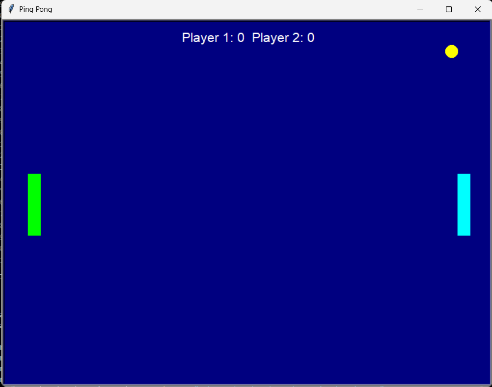

# Ping Pong Game 🏓

A classic Ping Pong (Pong) game built with Python's Turtle graphics library.



## Features

- **Two-player gameplay** - Play against a friend locally
- **Colorful UI** - Navy background with cyan and lime paddles, yellow ball
- **Score tracking** - Keep track of points for both players
- **Progressive difficulty** - Game speed increases every 5 points
- **Smooth controls** - Responsive paddle movement

## Controls

### Player 1 (Right Paddle - Cyan)
- **Up Arrow** - Move paddle up
- **Down Arrow** - Move paddle down

### Player 2 (Left Paddle - Lime)
- **W** - Move paddle up
- **S** - Move paddle down

## How to Play

1. Run the game using Python
2. Two players control their respective paddles
3. Hit the ball back and forth
4. Score points when your opponent misses the ball
5. Game gets faster every 5 combined points
6. Click anywhere on the screen to exit

## Installation

1. Make sure you have Python installed on your system
2. Clone this repository
3. Run the game:
   ```bash
   python script.py
   ```

## Requirements

- Python 3.x
- Turtle graphics library (included with Python)

## Game Mechanics

- Ball bounces off top and bottom walls
- Ball bounces off paddles when hit
- Ball resets to center when it goes off screen
- Scoring: Player gets a point when opponent misses
- Speed increases progressively based on total score

## Screenshots

The game features:
- Navy blue background
- Cyan paddle (Player 1)
- Lime green paddle (Player 2)
- Yellow ball
- White score display at the top

## Contributing

Feel free to fork this project and submit pull requests for any improvements!

## License

This project is open source and available under the MIT License.
